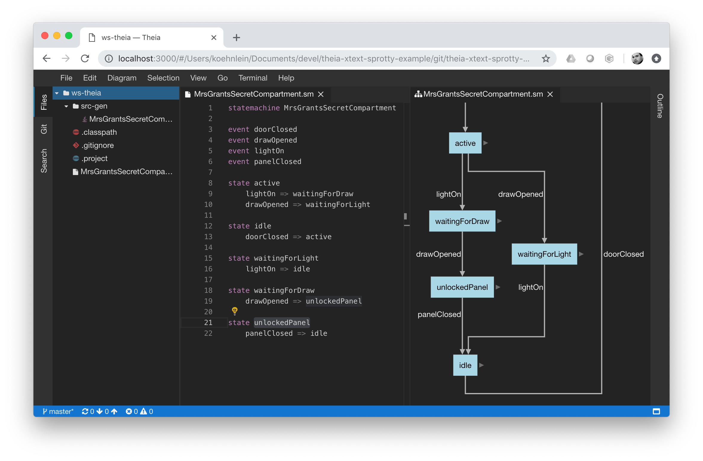

# A Domain-Specific Language IDE in the Cloud Using Open-Source Only

This is a tutorial on how to build a web-based IDE with support for an example domain-specific language (DSL) using open-source technologies only. In particular we employ the following technologies from the Eclipse project:

- [Xtext](http://www.eclipse.org/Xtext/) to implement a language server for a domain-specific language,
- [Theia](https://www.theia-ide.org/) to build an IDE that runs in the cloud or as desktop client,
- [Sprotty](https://projects.eclipse.org/projects/ecd.sprotty) to visualize the DSL models in diagrams,
- [Eclipse Layout Kernel](https://www.eclipse.org/elk/) to layout these diagrams automatically.

This example has been presented at EclipseCon Europe 2018 in Ludwigsburg ([recording](https://www.youtube.com/watch?v=IrFQKdjzvXU&feature=youtu.be), [slides](https://www.eclipsecon.org/sites/default/files/slides/DSLs%20in%20the%20Cloud%20-%20ECE18.pdf)).



## Structure

Each branch in this repository represents a major stage, each commit a subtask to be implemented to reach the stage.

The four stages are as follows:

### Stage 1: Implement a Language Server For a Statemachine DSL with Xtext

We create a new Xtext project, add a grammar for a statemachine DSL, and run the Xtext code generator to generate the [language server](https://microsoft.github.io/language-server-protocol/) (LS) for the DSL. We also add a bit of sugar in form of

- a parser test,
- a bit of scoping (customizing linking),
- a simple code generator that generates a Java class from a statemachine model,
- and some constraint checks.

### Stage 2: Create a Theia Application and Integrate the DSL Language Server

[](https://gitpod.io/#https://github.com/TypeFox/theia-xtext-sprotty-example/tree/xtext-dsl)

We use a [yeoman generator](https://github.com/theia-ide/generator-theia-extension) to create the skeleton for a theia-app with a custom extension. We turn the latter into a language extension for our DSL by copying the LS from the last stage, adding a grammar for highlighting and a bit of glue code. At the end of this stage, our IDE supports the textual statemachine language. Thanks to Xtext's, it already offers validation, content assist, hovers, navigation of references, etc.

### Stage 3: Add Live-Diagrams for the DSL with Sprotty

[](https://gitpod.io/#https://github.com/TypeFox/theia-xtext-sprotty-example/tree/graphical-view)

Text is nice, but we want a visual representation of the statemachines as well. Using the Sprotty framework, we add diagram support to the LS, generate a diagram model from the DSL models, and extend the client with a diagram widget. The diagram updates automatically when the source model changes. We use the ELK to layout these diagrams and fine-tune the visual representation. To tie the graphics even stronger to the text, we add tracing and validation markers. Now, selection in the text editor and the diagram are synchronized.

### Stage 4: Turn the Diagram View into a Graphical Editor (beta)

[](https://gitpod.io/#https://github.com/TypeFox/theia-xtext-sprotty-example/tree/master)

In this stage, we turn the graphical view into an editor. We add various interaction patterns to the diagrams to allow the creation of elements, the manipulation of edges, and the editing of labels. all these interactions are mapped to text modifications of the DSL model, such that the diagram is always generated from the text and never the other way around. It is far easier to keep the two representations consistent than with any bi-directional synchronization.

Note that the editing features of Sprotty are still in beta.

## Build/Run Instructions

### Gitpod

[Gitpod](https://www.gitpod.io) is a cloud IDE that is based on Theia as well. Gitpod allows to experiment with the contents of this repository without installing anything on your local machine.

The buttons above open the respective stage in Gitpod. To run it, wait for the build to finish and then click on the Open Browser button. An example workspace is opened in a new browser tab.

### Local

The prerequisites are defined [here](https://github.com/eclipse-theia/theia/blob/master/doc/Developing.md#prerequisites).

To build, run
```bash
cd language-server
./gradlew build
cd ../theia
yarn
```

From there, to run the browser app
```bash
cd browser-app
yarn start
```
and point your browser to `localhost:3000`.

Alternatively, run the electron app by running
```bash
yarn rebuild:electron
cd electron-app
yarn start
```

### Troubleshooting

Note, this example application is _single-sourced_. Whenever you want to switch between the electron and the browser-based applications, you have to rebuild it manually.
When switching to the electron, change the directory to `theia` and run the following:
```bash
yarn rebuild:electron
```

If you want to use the browser-based application, rebuild it for the browser from the `theia` folder:
```bash
yarn rebuild:browser
```
